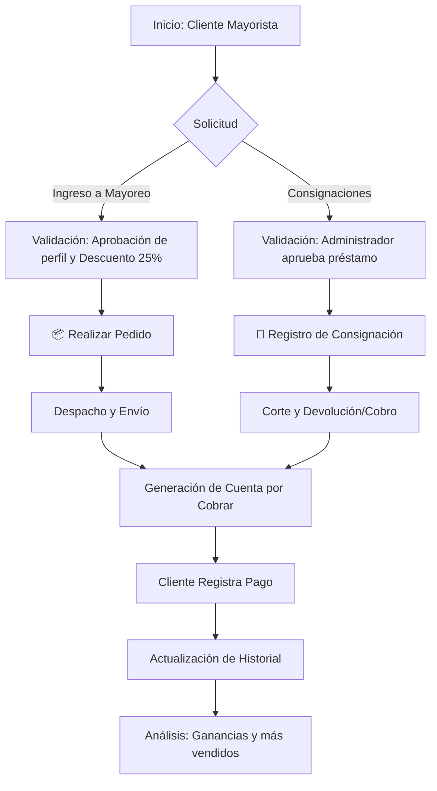

# 🌟 Manual de Usuario: Plataforma Mayorista Stella ERP

Bienvenido al manual operativo para **Usuarios Mayoristas** de Stella ERP. Esta guía rápida ha sido diseñada para brindarle toda la información necesaria sobre el uso de nuestro sistema, asegurando que pueda gestionar su inventario, pedidos y finanzas de manera autónoma, rápida y segura.

---

## 1. Introducción General del Sistema 🏢

**Stella ERP** es una plataforma integral de gestión administrativa y logística diseñada exclusivamente para optimizar la relación comercial con nuestros clientes mayoristas. A través de este portal, usted tendrá control total sobre sus operaciones en tiempo real, desde la solicitud de nueva mercancía hasta el seguimiento de su estado financiero y reportes de rendimiento.

---

## 2. Objetivo del Módulo Mayorista 🎯

El objetivo principal de este módulo es **empoderar al cliente mayorista** brindándole una herramienta de autogestión que le permita:
- Agilizar el proceso de abastecimiento de joyería.
- Mantener una visibilidad clara de sus finanzas y adeudos.
- Controlar de forma eficiente la mercancía bajo el esquema de consignación.
- Tomar decisiones informadas basadas en reportes automatizados.

---

## 3. Flujo Operativo Completo y Logística 🔄

El ecosistema de Stella ERP funciona bajo un ciclo logístico continuo que conecta sus solicitudes directamente con nuestro centro de distribución.

### Explicación Simple de la Logística
1. **Solicitud:** Usted genera una solicitud de ingreso a mayoreo o registra una consignación.
2. **Validación:**
   - *Ingreso a Mayoreo:* Se evalúa su perfil y al aprobarse se le asigna el 25% de descuento en el catálogo.
   - *Consignaciones:* Son validadas únicamente por el administrador (los nuevos usuarios no son aptos de inicio).
3. **Realizar Pedidos:** Una vez con cuenta activa, realiza sus pedidos con precios exclusivos o selecciona inventario para consignar.
4. **Despacho:** La mercancía es preparada y enviada (o entregada en tienda física).
5. **Finanzas:** Se genera automáticamente el registro en sus cuentas por cobrar.
6. **Análisis:** Toda la operación se refleja en su módulo de reportes para analizar ganancias, productos más vendidos y métricas.

### Diagrama de Flujo Operativo

---

## 4. Descripción Detallada por Módulo 📂

A continuación, explicaremos paso a paso cada uno de los apartados disponibles en su panel de control.

### 📦 1. Módulo de Pedidos

*Gestione la compra directa de su mercancía de forma rápida y estructurada.*

- **¿Para qué sirve?** Para solicitar nueva mercancía de nuestro catálogo de mayoreo.
- **¿Qué puede hacer el usuario?** Crear, consultar, editar (si no ha sido procesado) y dar seguimiento al envío de sus pedidos.
- **¿Cómo navegar?** Diríjase al menú lateral izquierdo y haga clic en **"Pedidos"**.
- **Acciones principales:** 
  - `Crear Pedido`: Seleccionar productos y cantidades.
  - `Ver Estatus`: Revisar si está Pendiente, Aprobado o Enviado.
- **Impacto Operativo:** Detona el proceso de empaquetado y envío en el almacén central de Stella.

#### 📝 Cómo utilizarlo paso a paso:
1. Haga clic en **Nuevo Pedido**.
2. Seleccione los artículos deseados del catálogo e ingrese las cantidades.
3. Confirme la dirección de envío o seleccione "Recoger en tienda".
4. Haga clic en **Confirmar Pedido**.

> 💡 **Ejemplo Práctico:** Se acerca el Día de las Madres y necesita reabastecer inventario de collares. Ingresa a "Pedidos", selecciona 20 collares de acero, confirma, y monitorea en tiempo real cuando el paquete sea entregado a la paquetería.

---

### 🤝 2. Módulo de Consignaciones

*Control operativo para mercancía otorgada a préstamo.*

- **¿Para qué sirve?** Para solicitar y gestionar inventario bajo el esquema de consignación (pago por mercancía vendida).
- **¿Qué puede hacer el usuario?** Registrar nuevas solicitudes de consignación, ver fechas de corte, y consultar qué mercancía debe devolver o liquidar.
- **¿Cómo navegar?** En el menú principal, seleccione **"Consignaciones"**.
- **Acciones principales:**
  - `Registro`: Solicitar un lote a consignación.
  - `Seguimiento`: Ver el tiempo restante antes de la fecha de corte.
  - `Validación`: Confirmar las piezas vendidas vs. devueltas.
- **Impacto Operativo:** Permite tener inventario físico sin inversión inicial, calculando automáticamente la deuda solo sobre lo vendido.

#### 📝 Cómo utilizarlo paso a paso:
1. Ingrese a la sección **Nueva Consignación**.
2. Elija los productos autorizados para este esquema.
3. Revise la **Fecha de Corte** (día en que debe reportar ventas).
4. Al llegar la fecha, ingrese al registro y marque qué piezas se vendieron y cuáles se devolverán.

> 💡 **Ejemplo Práctico:** Usted recibe 50 anillos en consignación. Tras 15 días, vende 30. En el sistema, reporta los 30 vendidos (lo cual genera una cuenta por cobrar) y el sistema le indica cómo devolver los 20 restantes.

---

### 💳 3. Módulo de Cuentas por Cobrar

*Transparencia financiera y control de adeudos.*

- **¿Para qué sirve?** Para visualizar el estado financiero exacto que tiene con Stella Joyería.
- **¿Qué puede hacer el usuario?** Consultar adeudos activos, revisar fechas de vencimiento de facturas y ver su historial de pagos.
- **¿Cómo navegar?** En el menú lateral, haga clic en **"Cuentas por Cobrar"**.
- **Acciones principales:**
  - `Consulta de Adeudos`: Ver saldos pendientes totales.
  - `Historial de Pagos`: Revisar pagos aplicados anteriormente.
  - `Fechas de Vencimiento`: Alertas de pagos próximos.
- **Impacto Operativo:** Evita suspensiones de servicio por falta de pago y mantiene la salud financiera de su negocio.

#### 📝 Cómo utilizarlo paso a paso:
1. Abra el módulo para ver su **Saldo Total Pendiente** en pantalla principal.
2. Observe la tabla inferior para ver el desglose factura por factura.
3. Note los indicadores de color: 🟢 Al corriente, 🟡 Próximo a vencer, 🔴 Vencido.

> 💡 **Ejemplo Práctico:** Usted hizo un pedido la semana pasada. Entra al módulo y ve que tiene un saldo de $2,500 MXN que vence en 3 días. Realiza su transferencia y, una vez que Stella la aprueba, el sistema registra el pago y su saldo baja a $0.

---

### 📊 4. Módulo de Reportes

*Inteligencia de negocios para su crecimiento.*

- **¿Para qué sirve?** Para brindarle estadísticas sobre sus compras y movimientos.
- **¿Qué puede hacer el usuario?** Visualizar gráficas de sus compras mensuales, aplicar filtros por fechas y exportar sus datos.
- **¿Cómo navegar?** Seleccione **"Reportes"** en su menú de usuario.
- **Acciones principales:**
  - `Visualización`: Gráficas de barras y pastel.
  - `Filtros`: Seleccionar rangos de fechas (Ej. Último trimestre).
  - `Exportación`: Descargar información en Excel / PDF.
- **Impacto Operativo:** Le permite identificar cuáles son los meses donde usted compra más, ayudándole a planificar sus futuras inversiones.

#### 📝 Cómo utilizarlo paso a paso:
1. Diríjase a **Reportes**.
2. En la parte superior, seleccione el rango de fechas (ej. "Enero a Marzo").
3. Analice la gráfica para ver sus productos más solicitados.
4. Haga clic en el botón de **Exportar a Excel** si desea guardar la información en su computadora.

> 💡 **Ejemplo Práctico:** A final de año, usted entra al módulo, filtra los últimos 12 meses, y descubre que sus ventas de "Chapa de Oro" superan a las de "Acero". Descarga el reporte para su contador.

---

## 5. Buenas Prácticas y Recomendaciones ⭐

Para sacar el máximo provecho de Stella ERP, le recomendamos:

1. **Revisión Semanal:** Ingrese al menos una vez por semana al módulo de *Cuentas por Cobrar* para evitar atrasos.
2. **Anticipe sus Pedidos:** Los tiempos de envío varían; utilice el módulo de *Pedidos* con al menos 3 días de anticipación a sus fechas fuertes de venta.
3. **Cortes Puntuales:** En el módulo de *Consignaciones*, respete las fechas de corte para mantener su estatus de mayorista preferencial.
4. **Use los Filtros:** En los *Reportes*, filtre por meses específicos para entender la estacionalidad de sus ventas.

---

## 6. Solución de Errores y Problemas Frecuentes 🛠️

| Problema | Causa Posible | Solución |
| :--- | :--- | :--- |
| **Mi pedido no cambia a estado "Enviado"** | El pago del envío no ha sido reportado o el pedido se hizo fuera de horario. | Si ya realizó el pago, espere 24h hábiles. Puede contactar a soporte vía WhatsApp si es urgente. |
| **No me permite solicitar nueva Consignación** | Tiene consignaciones vencidas sin reportar o deudas atrasadas. | Vaya a "Cuentas por Cobrar" o "Consignaciones", liquide sus adeudos/devuelva mercancía y el sistema se desbloqueará. |
| **El pago que realicé no aparece en sistema** | Stella ERP requiere validación manual de las transferencias. | Los pagos pueden tardar hasta 12 horas en reflejarse. Asegúrese de haber enviado el comprobante a su asesor. |
| **No puedo descargar el Reporte** | Bloqueo de ventanas emergentes en su navegador. | Permita las "pop-ups" o ventanas emergentes en la configuración de su navegador de internet. |

---

*¿Necesita más ayuda? Contacte a nuestro equipo de soporte directamente desde el chat en la plataforma o a nuestro Instagram **@stellajoyeriar**.*
